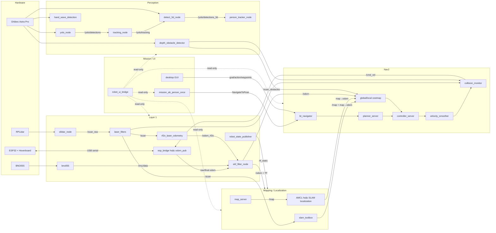
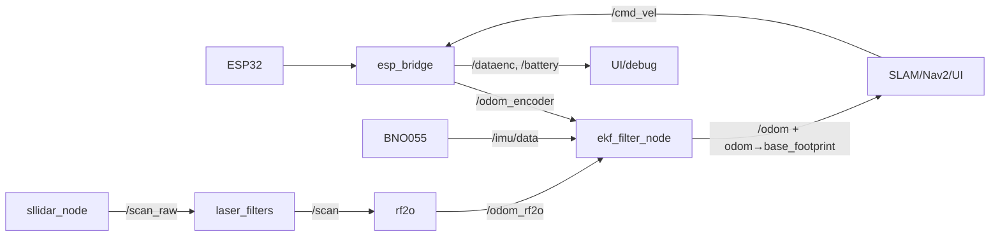
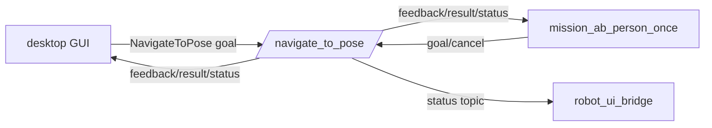
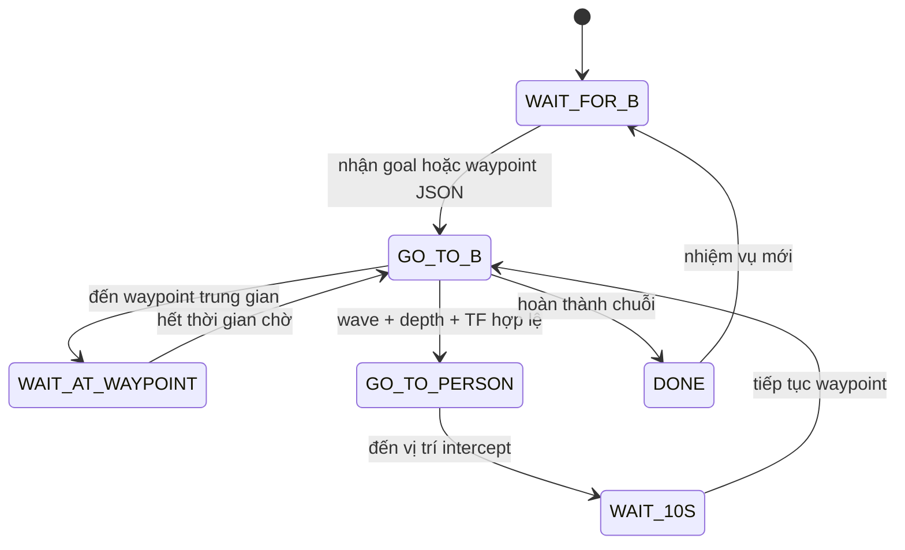

# ROS 2 System Architecture

## 1. Mục đích và phạm vi

Tài liệu mô tả kiến trúc ROS 2 của repository tại commit `e12d3de`, phục vụ việc lấy dữ liệu cho giao diện người dùng và kiểm tra graph runtime.

Phạm vi rà soát:

- Mã nguồn ROS 2, launch, YAML, URDF.
- Firmware ESP32 và protocol serial.
- Pipeline LiDAR, IMU, camera depth, YOLO, hand wave.
- SLAM, localization, Nav2, mission.
- Desktop GUI và web UI.

Các thư mục sinh tự động `build/`, `install/`, `log/` không được coi là nguồn kiến trúc.

> Đây là **static graph** suy ra từ mã nguồn. Graph runtime thay đổi theo launch mode, lifecycle state, namespace và node thực sự đang chạy. Dùng các lệnh ở cuối tài liệu để xác nhận trên robot.

### Ký hiệu

- **Hiện hữu**: có producer/consumer trong mã nguồn.
- **Theo launch**: chỉ xuất hiện trong mode tương ứng.
- **Kỳ vọng**: UI/config đang chờ nhưng chưa thấy producer.
- **Legacy/dev**: công cụ cũ, thử nghiệm hoặc không thuộc luồng chính.

## 2. Kết luận kiến trúc nhanh

1. Stack hiện tại vận hành như **differential/tank drive**, không phải mecanum holonomic:
   - ESP32 chỉ nhận `linear.x`, `angular.z`; sau đó tính bánh trái/phải.
   - Odometry dùng hai encoder và `wheel_base`.
   - Nav2 MPPI dùng `motion_model: DiffDrive`; `vy` bằng `0`.
   - URDF chỉ có `wheel_left_link`, `wheel_right_link`.
2. Có ba chiến lược odometry, không chạy chồng:
   - ESP trực tiếp: `odom_pub` publish `/odom` và TF.
   - RF2O trực tiếp: RF2O publish `/odom` và TF; ESP publish `/odom_esp_raw`.
   - Layer1 fusion: `/odom_encoder` + `/imu/data` + `/odom_rf2o` -> EKF -> `/odom` + TF.
3. Nav2 dùng hai nguồn vật cản: `/scan` và `/scan_obstacles`.
4. Vision có hai pipeline độc lập: YOLO và hand-wave detector.
5. Mission không subscribe `/pose/wave_detected` hoặc `/person_tracking`; nó đọc keypoint trong `/yolo/detections`.
6. Web UI hiện read-only; không publish command hoặc gửi action.
7. `/mission/status` được web UI chờ nhưng chưa có publisher trong mission code.

### 2.1 Inventory package và vai trò

| Package/thành phần | Loại | Vai trò trong graph hiện tại |
|---|---|---|
| `layer1_bringup` | Custom, active | Bringup phần cứng, ESP bridge, RF2O, EKF. |
| `bno055_imu` | Custom, active | Driver BNO055 -> `/imu/data`. |
| `odom_pub` | Custom, active | Serial bridge + direct wheel/IMU odometry. |
| `mo_hinh` | Custom, active | URDF, map, config, launch real/simulation. |
| `depth_obstacle_detector` | Custom, active | Depth camera -> `/scan_obstacles`; có debugger GUI. |
| `HandWaveDetection_Pose` | Custom, active | Pose inference và hand-wave topics. |
| `nhiemvuboss` | Custom, một phần lỗi | Mission, route GUI, waypoint JSON. |
| `robot_ui` | Custom, active | FastAPI, WebSocket, ROS bridge, React dashboard. |
| `yolo_ros` | Vendor có chỉnh sửa | YOLO, tracking, 3D detection, person tracker. |
| `yolo_msgs` | Interface package | Detection, bbox, keypoint, person tracking messages. |
| `sllidar_ros2` | Vendor, active | RPLidar driver và motor services. |
| `rf2o_laser_odometry` | Vendor, active | Laser odometry. |
| `imu_tools` | Vendor, không nối vào launch chính | Complementary/Madgwick filters và RViz plugin. |
| `ros2_astra_camera` | Gitlink chưa hoàn chỉnh | Camera driver được script/README tham chiếu. |
| `esp32` | Firmware | USB serial bridge, RC/BLE, hoverboard command/feedback. |
| `src/gui.py`, `gui_v2.py`, `gui_v3.py` | Standalone/legacy | Desktop navigation, map edit, launch/process control. |
| `src/map_editor.py` | Standalone utility | Sửa ảnh map và YAML; không tạo ROS node. |
| `my_map/` | Runtime data | Map YAML/PGM, posegraph, depth-ground calibration. |

Các thành phần không nằm trong graph vận hành chính:

- `imu_complementary_filter`, `imu_filter_madgwick`, `rviz_imu_plugin`: có source/launch riêng nhưng không được include bởi bringup hiện tại.
- `nhiemvuboss (copy).py`, `wave_hand_detector.py`: legacy/standalone; không tạo node ROS trong luồng chính.
- `depth_obstacle_detector/debugger_gui.py`: dùng để hiệu chỉnh, thay thế detector headless khi chạy; không chạy đồng thời.
- `robot_ui/frontend/src/api/demoState.ts`: dữ liệu demo, không phải ROS runtime source.

## 3. Sơ đồ tổng thể



## 4. Mode vận hành chính

### 4.1 Layer1 fused odometry

```bash
ros2 launch layer1_bringup layer1.launch.py
```



- `esp_bridge` không publish TF.
- RF2O dùng `publish_tf: false`.
- EKF là nguồn duy nhất publish `odom -> base_footprint`.
- EKF chạy `30 Hz`.

### 4.2 ESP odometry trực tiếp

```bash
ros2 launch mo_hinh real_odom.launch.py odom_source:=esp
```

- `odom_pub` đọc serial, subscribe `/imu/data`, `/cmd_vel`.
- Publish `/odom`, `/battery`, `/dataenc`.
- Publish TF `odom -> base_footprint`.
- Không chạy thêm `esp_bridge` hoặc EKF trên cùng serial/TF.

### 4.3 RF2O odometry trực tiếp

```bash
ros2 launch mo_hinh real_odom.launch.py odom_source:=rf2o
```

- `odom_pub` vẫn giữ serial và nhận `/cmd_vel`.
- Odom ESP remap thành `/odom_esp_raw`; `publish_tf=false`.
- RF2O publish `/odom` và TF.

### 4.4 SLAM mapping

```bash
ros2 launch mo_hinh real_slam.launch.py
```

```mermaid
flowchart LR
    SCAN[/scan/] --> SLAM[async_slam_toolbox_node]
    ODOM[/odom/] --> SLAM
    TF1[odom→base_footprint] --> SLAM
    TF2[base→laser_link] --> SLAM
    SLAM --> MAP[/map/]
    SLAM --> TF3[map→odom]
    SLAM --> SRV[/slam_toolbox/serialize_map]
```

### 4.5 Localization + Nav2

```bash
ros2 launch mo_hinh real_localization_nav2.launch.py localization_mode:=amcl
ros2 launch mo_hinh real_localization_nav2.launch.py localization_mode:=slam_toolbox
```

- AMCL mode: `map_server` + AMCL + Nav2 bringup.
- SLAM localization mode: posegraph + `localization_slam_toolbox_node` + Nav2 navigation.
- Chỉ chạy một localization source để tránh trùng `map -> odom`.

## 5. TF graph

### 5.1 Cây TF mục tiêu

```text
map
└── odom
    └── base_footprint
        └── base_link
            ├── imu_link
            ├── laser_link
            ├── support_link
            ├── camera_link
            │   ├── camera_color_optical_frame
            │   └── camera_depth_optical_frame
            ├── wheel_left_link
            ├── wheel_right_link
            ├── sonar_center_link
            ├── sonar_left_link
            └── sonar_right_link
```

### 5.2 Nguồn TF

| Transform | Nguồn dự kiến | Ghi chú |
|---|---|---|
| `map -> odom` | AMCL hoặc `slam_toolbox` | Chỉ chạy một localization source. |
| `odom -> base_footprint` | `odom_pub`, RF2O hoặc EKF | Chỉ một nguồn được publish. |
| `base_footprint -> base_link` | `robot_state_publisher` | Fixed joint trong `xe.urdf`. |
| `base_link -> imu_link` | `robot_state_publisher` | Offset Z `0.055 m`. |
| `base_link -> laser_link` | `robot_state_publisher` | Offset Z `0.15 m`. |
| `base_link -> camera_link` | `robot_state_publisher` | Vị trí `0.30, 0.14, 0.87`; pitch khoảng `40°`. |
| `camera_link -> *_optical_frame` | `robot_state_publisher` | Optical rotation cố định. |

Driver Astra có thể publish TF camera riêng. `src/ros2_astra_camera` hiện là Git gitlink nhưng thiếu mapping `.gitmodules`, nên chưa thể xác nhận nội dung driver. Cần kiểm tra duplicate TF authority tại runtime.

## 6. Danh mục node

### 6.1 Hardware và state estimation

| Node runtime | Package/executable | Subscribe | Publish | Vai trò |
|---|---|---|---|---|
| `/robot_state_publisher` | `robot_state_publisher` | Robot description | `/tf`, `/tf_static` | TF tĩnh từ URDF. |
| `/sllidar_node` | `sllidar_ros2/sllidar_node` | Serial LiDAR | `scan`, remap `/scan_raw` | Driver RPLidar. |
| `/scan_to_scan_filter_chain` | `laser_filters` | `/scan_raw` | `/scan` | Loại điểm trong box thân robot. |
| `/bno055` | `bno055_imu/bnoneko` | I2C BNO055 | `/imu/data` | Orientation, gyro, acceleration. |
| `/esp_bridge` | `layer1_bringup/esp_bridge` | `/cmd_vel`, serial | `/odom_encoder`, `/battery`, `/dataenc` | Bridge serial cho EKF mode. |
| `/odom_pub` | `odom_pub/odom_pub` | `/cmd_vel`, `/imu/data`, serial | `/odom` hoặc `/odom_esp_raw`, `/battery`, `/dataenc`, tùy chọn TF | Bridge + odometry trực tiếp. |
| `/rf2o_laser_odometry` | `rf2o_laser_odometry_node` | `/scan` | `/odom_rf2o` hoặc `/odom`, tùy chọn TF | Laser scan odometry. |
| `/ekf_filter_node` | `robot_localization/ekf_node` | `/odom_encoder`, `/imu/data`, `/odom_rf2o` | `/odom`, `/tf` | Sensor fusion. |

### 6.2 Mapping, localization, navigation

| Node/stack | Subscribe chính | Publish/API chính | Vai trò |
|---|---|---|---|
| `async_slam_toolbox_node` | `/scan`, `/odom`, TF | `/map`, `map -> odom`, map services | SLAM mapping. |
| `localization_slam_toolbox_node` | Posegraph, `/scan`, `/odom`, TF | `/map`, `map -> odom` | Posegraph localization. |
| `map_server` | Map YAML | `/map` | Static occupancy map. |
| `amcl` | `/map`, `/scan`, `/odom`, TF | Pose estimate, `map -> odom` | Particle localization. |
| `planner_server` | Global costmap, goal | `/plan` | Global planning. |
| `controller_server` | `/plan`, local costmap, `/odom` | Local command/path | Local control. |
| `bt_navigator` | NavigateToPose goals | Action feedback/result/status | Behavior tree. |
| `global_costmap` | `/map`, `/scan`, `/scan_obstacles`, TF | `/global_costmap/costmap_raw` | Global obstacle model. |
| `local_costmap` | `/scan`, `/scan_obstacles`, `/odom`, TF | `/local_costmap/costmap_raw` | Local obstacle model. |
| `velocity_smoother` | Nav2 velocity command | `cmd_vel_smoothed` | Giới hạn vận tốc/gia tốc. |
| `collision_monitor` | `cmd_vel_smoothed`, `/scan`, `/scan_obstacles` | `/cmd_vel`, `collision_monitor_state` | Lớp an toàn cuối. |

### 6.3 Camera, depth, YOLO và hand wave

| Node runtime | Subscribe | Publish | Ghi chú |
|---|---|---|---|
| Astra camera nodes | USB camera | Color/depth images và CameraInfo | Driver ngoài source tree khả dụng. |
| `/depth_obstacle_detector_node` | Depth image, CameraInfo, TF | `/scan_obstacles` | Depth ROI thành `LaserScan`. |
| `/depth_obstacle_debugger_node` | Depth image, CameraInfo, TF | `/scan_obstacles` | GUI hiệu chỉnh; không chạy cùng detector headless. |
| `/yolo/yolo_node` | Color image | `/yolo/detections` | Lifecycle detection node. |
| `/yolo/tracking_node` | Color image + detections | `/yolo/tracking` | BYTETrack/BOT-SORT. |
| `/yolo/detect_3d_node` | Depth + CameraInfo + detection + TF | `/yolo/detections_3d` | Gắn bbox/keypoint 3D. |
| `/yolo/debug_node` | Color image + detection | Debug image và markers | Chỉ chạy khi `use_debug:=True`. |
| `/person_tracker_node` | `/yolo/detections_3d` | `/person_tracking` | Chọn target ID hoặc người gần nhất. |
| `/hand_wave_detection` | `/camera/color/image_raw` | `/pose/image_debug`, `/pose/wave_detected`, `/pose/wave_status` | Pipeline wave riêng. |

### 6.4 Mission và giao diện

| Node/process | Input | Output | Trạng thái |
|---|---|---|---|
| `/mission_ab_person_once` | YOLO detections, camera, depth, goal, waypoint JSON, TF | `/cmd_vel`, NavigateToPose goals | Mission node thực tế. |
| `/route_gui_node` | `/map`, TF | `/goal_pose` | GUI route legacy. |
| `/desktop_nav_gui_v2` | `/map`, `/scan`, `/dataenc`, TF | Goal, waypoint JSON, `/cmd_vel`, Nav2 action/service | Desktop GUI có write/control. |
| `/desktop_nav_gui_v3` | `/map1`, `/scan`, `/dataenc`, TF | `/map`, goal, waypoint JSON, Nav2 action | Map-edit thử nghiệm. |
| `/robot_ui_bridge` | Telemetry topics, TF, graph introspection | Không publish ROS command | Web backend read-only. |
| `robot_ui_server` | HTTP/WebSocket | REST, WebSocket, frontend | FastAPI/Uvicorn process. |

## 7. Topic graph chi tiết

### 7.1 Điều khiển và phần cứng

| Topic | Type | Publisher dự kiến | Subscriber dự kiến | Dùng cho UI |
|---|---|---|---|---|
| `/cmd_vel` | `geometry_msgs/msg/Twist` | Collision monitor, mission, desktop GUI | `esp_bridge` hoặc `odom_pub` | Command hiện tại, source, age, timeout. |
| `/battery` | `sensor_msgs/msg/BatteryState` | `esp_bridge` hoặc `odom_pub` | `robot_ui_bridge` | Voltage, temperature, present. `percentage` chưa được tính. |
| `/dataenc` | `std_msgs/msg/Int32MultiArray` | `esp_bridge` hoặc `odom_pub` | GUI, web UI | `[encoder_left, encoder_right]`. |
| `/odom_encoder` | `nav_msgs/msg/Odometry` | `esp_bridge` | EKF | Raw encoder odometry. |
| `/odom_esp_raw` | `nav_msgs/msg/Odometry` | `odom_pub` trong RF2O mode | Debug/UI tùy chọn | ESP odom khi RF2O giữ `/odom`. |
| `/imu/data` | `sensor_msgs/msg/Imu` | BNO055 node | `odom_pub`, EKF | Orientation, gyro, acceleration. |

Serial ROS–ESP32:

- ROS gửi `V <linear_x> <angular_z>\n` khoảng `10 Hz`.
- ESP32 trả telemetry khoảng `20 Hz`:

```text
V:<velocity> A:<acceleration> RC:<throttle>/<steer> TL:<left_cmd> TR:<right_cmd> EL:<left_ticks> ER:<right_ticks> B:<voltage> T:<temperature>
```

### 7.2 LiDAR, odometry và map

| Topic | Type | Publisher | Consumer |
|---|---|---|---|
| `/scan_raw` | `sensor_msgs/msg/LaserScan` | `sllidar_node` qua remap | `laser_filters`. |
| `/scan` | `sensor_msgs/msg/LaserScan` | `laser_filters` | RF2O, SLAM, AMCL, Nav2, GUI, web UI. |
| `/odom_rf2o` | `nav_msgs/msg/Odometry` | RF2O trong layer1 | EKF. |
| `/odom` | `nav_msgs/msg/Odometry` | Một trong `odom_pub`, RF2O, EKF | SLAM, localization, Nav2, GUI, web UI. |
| `/map` | `nav_msgs/msg/OccupancyGrid` | SLAM, map server hoặc localization | Nav2, GUI, web UI. |
| `/map1` | `nav_msgs/msg/OccupancyGrid` | SLAM khi GUI v3 sửa param runtime | Desktop GUI v3; workflow thử nghiệm. |
| `/tf` | `tf2_msgs/msg/TFMessage` | Localization, odom source, RSP | Toàn stack. |
| `/tf_static` | `tf2_msgs/msg/TFMessage` | RSP/camera driver | Toàn stack. |

### 7.3 Camera và obstacle scan

| Topic | Type | Publisher | Consumer |
|---|---|---|---|
| `/camera/color/image_raw` | `sensor_msgs/msg/Image` | Astra | YOLO, hand-wave. |
| `/camera/color/camera_info` | `sensor_msgs/msg/CameraInfo` | Astra | Mission, web UI health. |
| `/camera/depth/image_raw` | `sensor_msgs/msg/Image` | Astra | Depth obstacle, 3D YOLO, mission. |
| `/camera/depth/camera_info` | `sensor_msgs/msg/CameraInfo` | Astra | Depth obstacle, 3D YOLO, web UI. |
| `/scan_obstacles` | `sensor_msgs/msg/LaserScan` | Depth detector/debugger | Nav2 costmaps, collision monitor, web UI. |

Depth detector dùng `my_map/cam.yaml`:

- ROI: `x=1`, `y=108`, `width=614`, `height=298`.
- Ground reference: `/home/orin/ros2_ws/my_map/cam_nen.npy`.
- `target_frame: base_link`.
- `distance_offset: -0.22 m`.
- LaserScan range: `0.4–5.0 m`.

### 7.4 YOLO và pose

| Topic/service | Type | Producer | Consumer |
|---|---|---|---|
| `/yolo/detections` | `yolo_msgs/msg/DetectionArray` | YOLO node | Tracking, mission, web UI. |
| `/yolo/tracking` | `yolo_msgs/msg/DetectionArray` | Tracking node | 3D detector khi tracking bật. |
| `/yolo/detections_3d` | `yolo_msgs/msg/DetectionArray` | 3D detector | Person tracker. |
| `/person_tracking` | `yolo_msgs/msg/PersonTracking` | Person tracker | Chưa thấy consumer trong repo. |
| `/yolo/dbg_image` | `sensor_msgs/msg/Image` | Debug node | rqt/image UI. |
| `/yolo/dgb_bb_markers` | `visualization_msgs/msg/MarkerArray` | Debug node | RViz. |
| `/yolo/dgb_kp_markers` | `visualization_msgs/msg/MarkerArray` | Debug node | RViz. |
| `/yolo/enable` | `std_srvs/srv/SetBool` | YOLO service | Bật/tắt inference. |
| `/yolo/set_classes` | `yolo_msgs/srv/SetClasses` | YOLOWorld-only service | Đổi class runtime. |

`DetectionArray` chứa `Detection[]`. Mỗi detection có:

- `class_id`, `class_name`, `score`, tracking `id`.
- `bbox` 2D.
- `bbox3d` và frame 3D sau detect-3D.
- Segmentation `mask`.
- Keypoint 2D/3D nếu model hỗ trợ pose.

`PersonTracking` chứa `id`, tọa độ ảnh `u/v`, `distance`, `position_3d`. Quy ước code: `x` tiến, `y` trái, `z` lên.

### 7.5 Hand-wave

| Topic | Type | Nội dung |
|---|---|---|
| `/pose/image_debug` | `sensor_msgs/msg/Image` | Ảnh skeleton/trạng thái pose. |
| `/pose/wave_detected` | `std_msgs/msg/Bool` | `true` nếu frame hiện tại có wave event. |
| `/pose/wave_status` | `std_msgs/msg/String` | Chuỗi `[person_<id>] Waving with <state> hand!`. |

`/pose/wave_status` chỉ publish khi có event. UI phải dùng timestamp/stale timeout, không giữ trạng thái wave vô hạn.

### 7.6 Navigation và mission

| Topic/API | Type | Producer/Server | Consumer/Client |
|---|---|---|---|
| `/goal_pose` | `geometry_msgs/msg/PoseStamped` | RViz, desktop/route GUI | Mission interactive; Nav2 tools. |
| `/nhiemvuboss/waypoints_json` | `std_msgs/msg/String` | Desktop GUI v2/v3 | Mission. Payload `{waypoints: [...]}`. |
| `/navigate_to_pose` | `nav2_msgs/action/NavigateToPose` | Nav2 `bt_navigator` | Mission, desktop GUI. |
| `/navigate_to_pose/_action/status` | `action_msgs/msg/GoalStatusArray` | Nav2 | Web UI. |
| `/plan` | `nav_msgs/msg/Path` | Global planner | Controller, RViz, web UI. |
| `/local_plan` | `nav_msgs/msg/Path` | Controller/plugin nếu publish | RViz, web UI; xác nhận tên runtime. |
| `/global_costmap/costmap_raw` | `nav_msgs/msg/OccupancyGrid` | Global costmap | Web UI. |
| `/local_costmap/costmap_raw` | `nav_msgs/msg/OccupancyGrid` | Local costmap | Web UI. |
| `/collision_monitor_state` | Nav2 collision-monitor message | Collision monitor | Web UI chưa subscribe. |
| `/mission/status` | `std_msgs/msg/String` JSON | **Không thấy publisher** | Web UI kỳ vọng `2 Hz`. |

## 8. Action và service graph



| Service | Type | Server | Client/usage |
|---|---|---|---|
| `/start_motor` | `std_srvs/srv/Empty` | `sllidar_node` | Bật motor LiDAR. |
| `/stop_motor` | `std_srvs/srv/Empty` | `sllidar_node` | Tắt motor LiDAR. |
| `/yolo/enable` | `std_srvs/srv/SetBool` | YOLO node | Bật/tắt inference. |
| `/yolo/set_classes` | `yolo_msgs/srv/SetClasses` | YOLOWorld node | Chọn class. |
| `/slam_toolbox/serialize_map` | `slam_toolbox/srv/SerializePoseGraph` | SLAM toolbox | Lưu posegraph. |
| `/navigate_to_pose/_action/cancel_goal` | `action_msgs/srv/CancelGoal` | Nav2 | Desktop GUI v2. |
| `/navigate_through_poses/_action/cancel_goal` | `action_msgs/srv/CancelGoal` | Nav2 | Desktop GUI v2. |

## 9. Mission state machine thực tế

Node `/mission_ab_person_once` nằm trong `src/nhiemvuboss/nhiemvuboss/nhiemvuboss.py`.



Điều kiện intercept:

1. Detection có `class_name == person`, đủ `min_confidence`.
2. Keypoint trong `/yolo/detections` cho thấy tay cao hơn đầu.
3. Tay được giữ đủ `wave_hold_seconds`.
4. Có color CameraInfo và depth image.
5. Khoảng cách hợp lệ.
6. Có TF camera/map khi `require_map_tf=true`.

Hệ quả:

- Mission không dùng output `hand_wave_detection`.
- Mission không dùng `/person_tracking`.
- Nếu YOLO chạy model detection thuần như `yolo11n.pt`, detection có thể không chứa pose keypoint; intercept wave sẽ không kích hoạt. Cần model pose hoặc bridge wave event có target identity.

## 10. Launch matrix

| Launch/script | Khởi tạo | Mục đích | Lưu ý |
|---|---|---|---|
| `layer1_bringup/layer1.launch.py` | RSP, LiDAR, filter, BNO055, ESP bridge, RF2O, EKF | Hardware + fused odom | Mode fusion đầy đủ. |
| `mo_hinh/real_hw.launch.py` | RSP, LiDAR, filter, BNO055, `odom_pub` | Hardware + direct ESP odom | Đã gồm serial node. |
| `mo_hinh/real_odom.launch.py` | Include `real_hw`; optional RF2O | Chọn ESP hoặc RF2O làm `/odom` | Không chạy thêm `real_hw`. |
| `mo_hinh/real_slam.launch.py` | SLAM toolbox, RViz | Mapping robot thật | Yêu cầu odom layer chạy trước. |
| `mo_hinh/real_localization_nav2.launch.py` | AMCL/SLAM localization + Nav2 + RViz | Navigation | Chỉ một localization mode. |
| `mo_hinh/nav2_static_map_bringup.launch.py` | Hardware + Nav2 all-in-one | Legacy one-shot | Có đường dẫn hard-code. |
| `mo_hinh/no_ekf.launch.py` | Hardware + direct odom + SLAM | Legacy mapping | Trùng workflow mới. |
| `mo_hinh/run_ekf.launch.py` | EKF riêng | Thử nghiệm fusion | Kiểm tra input/remap. |
| `mo_hinh/slam_localization.launch.py` | SLAM localization | Localization-only | Không tự launch hardware/Nav2. |
| `mo_hinh/virtual_robot_gazebo.launch.py` | Gazebo + RSP + spawn | Robot ảo | Cần kiểm tra sensor/control plugins. |
| `mo_hinh/virtual_slam.launch.py` | Gazebo + SLAM + Nav2 + RViz | Simulation all-in-one | `use_sim_time=true`. |
| `yolo_bringup/yolo.launch.py` | YOLO + optional tracking/3D/debug | Vision | Các node chính là lifecycle nodes. |
| `yolo_bringup/person_follower.launch.py` | YOLO tracking + 3D + person tracker | `/person_tracking` | Debug tắt mặc định. |
| `hand_wave_detection.launch.py` | Hand-wave node | Pose/wave | Độc lập mission hiện tại. |
| `robot_ui/robot_ui.launch.py` | FastAPI + ROS bridge | Web dashboard | Read-only. |
| `start_person_following.sh` | Astra + person follower + hand-wave | Perception | Không launch mission, Nav2, hardware base. |

## 11. Web UI: dữ liệu hiện đã nối

`robot_ui_bridge` subscribe:

| Nhóm UI | Topic | Dữ liệu hiển thị |
|---|---|---|
| Hardware | `/battery` | Voltage, temperature, percentage nếu có, present, age/rate. |
| Hardware | `/dataenc` | Encoder left/right. |
| Navigation | `/map` | Occupancy map downsampled. |
| Navigation | `/odom` | X/Y/yaw, linear/angular velocity. |
| Navigation | `/scan` | Polar scan preview, min range, valid count. |
| Navigation | `/goal_pose` | Goal X/Y/yaw. |
| Navigation | `/plan`, `/local_plan` | Global/local path. |
| Navigation | Costmap raw topics | Costmap previews. |
| Navigation | NavigateToPose status | Goal state và transition history. |
| Mission | `/mission/status` | Hiện chưa có producer. |
| Vision | Color/depth CameraInfo | Camera alive, dimensions, frame, rate. |
| Vision | `/yolo/detections` | Detection count, class distribution, samples. |
| Vision | Wave topics | Wave state/status với timeout. |
| Vision | `/scan_obstacles` | Min obstacle, valid rays, frame, rate. |
| Diagnostics | `/diagnostics`, `/rosout` | Health và log. |
| ROS graph | Graph introspection | Node/topic/edge graph mỗi `2 s`. |
| Host | System monitor | CPU, RAM, disk, temperature, Jetson GPU. |

HTTP/WebSocket:

```text
GET /api/v1/health
GET /api/v1/state
GET /api/v1/config
GET /api/v1/ros/graph
WS  /ws/telemetry
```

WebSocket mặc định gửi snapshot mỗi `500 ms`.

### Dữ liệu nên bổ sung cho UI

1. `/cmd_vel`: command, age, publisher authority, timeout.
2. `/odom_encoder`, `/odom_rf2o`, `/odom_esp_raw`: so sánh drift với `/odom` final.
3. `/person_tracking`, `/yolo/detections_3d`: target ID, distance, vị trí, last-seen.
4. `/collision_monitor_state`: stop/slowdown/approach state.
5. TF health: chain, authority, timestamp, missing transform.
6. Lifecycle state của YOLO và Nav2.
7. Serial health: port state, telemetry age, parse/reconnect errors.
8. Mission status chuẩn hóa bằng custom message hoặc schema JSON versioned.

## 12. Điểm không nhất quán và rủi ro runtime

### 12.1 Mission launch hiện bị hỏng

`src/nhiemvuboss/setup.py` khai báo:

```text
multi_waypoint_mission = nhiemvuboss.multi_waypoint_mission:main
```

Nhưng `src/nhiemvuboss/nhiemvuboss/multi_waypoint_mission.py` không tồn tại. Executable trong `multi_waypoint_mission.launch.py` không thể chạy ở hiện trạng.

### 12.2 Tham số mission launch không khớp node

Launch truyền các tham số node không declare:

- `use_fixed_goals`.
- `waypoint_file`.
- `wait_after_person_seconds`.

Node thực tế dùng:

- `use_fixed_goal_B`.
- `/nhiemvuboss/waypoints_json` hoặc `/goal_pose`.
- `wait_seconds`.

### 12.3 `/mission/status` chưa có producer

Web UI README/config/bridge mô tả mission status JSON `2 Hz`, nhưng không có `create_publisher` tương ứng trong package mission.

Kết quả:

- Topic `WAITING` hoặc `STALE`.
- Mission page không có dữ liệu thật.
- Demo frontend có sample data, dễ gây nhầm khi preview Windows.

### 12.4 Hand-wave và mission chưa nối nhau

- Hand-wave node publish `/pose/wave_detected`, `/pose/wave_status`.
- Mission không subscribe hai topic này.
- Mission tự suy luận hand raised từ keypoint YOLO.
- Startup script không tạo bridge identity giữa wave event và target person.

### 12.5 `/person_tracking` không có consumer

`person_tracker_node` publish `/person_tracking`; repository không có subscriber. Đây là output tiềm năng cho Behavior Tree/UI.

### 12.6 Nhiều publisher `/cmd_vel`

Nguồn có thể gồm Nav2 collision monitor, mission và desktop GUI v2. ROS 2 không tự phân quyền command source. Nên thêm `twist_mux` hoặc command arbiter có priority, lock, deadman timeout.

### 12.7 Nhiều nguồn odom, telemetry và TF

Không chạy đồng thời:

- `esp_bridge` và `odom_pub` trên cùng serial.
- EKF TF cùng `odom_pub.publish_tf=true`.
- RF2O TF cùng nguồn `odom -> base_footprint` khác.
- `esp_bridge` và `odom_pub` cùng publish `/battery`, `/dataenc`.

### 12.8 Đường dẫn hard-code

Nhiều file dùng `/home/orin/ros2_ws/...`, `/dev/ttyUSB*`, `/dev/esp32`, `/dev/rplidar`. Nên chuyển sang package share path, launch arguments hoặc package config.

### 12.9 Hai bộ config song song

Config tồn tại ở root `config/` và `src/mo_hinh/config/`; gần giống nhưng không hoàn toàn đồng nhất. Root `config/nav2_params.yaml` hard-code custom BT XML; bản package không dùng đường dẫn đó.

UI nên hiển thị config source thực tế.

### 12.10 Astra camera Git dependency chưa hoàn chỉnh

`src/ros2_astra_camera` là gitlink commit `f7e71d9...`, nhưng không có `.gitmodules` mapping. Clone mới có thể không lấy được camera source.

### 12.11 QoS cần kiểm tra runtime

- Camera và LaserScan thường dùng best-effort sensor QoS.
- Một số custom subscriber dùng queue integer mặc định reliable.
- `depth_obstacle_detector` subscribe camera bằng QoS `10`; có thể không match publisher best-effort tùy driver/RMW.
- Hand-wave và YOLO dùng sensor/best-effort QoS phù hợp hơn.

### 12.12 Simulation chưa phản ánh rõ hardware base

Gazebo launch spawn URDF, nhưng source hiện không cho thấy rõ drive/LiDAR/IMU/camera plugin hoàn chỉnh. Cần xác nhận `/scan`, `/odom`, `/cmd_vel`, camera khi simulation chạy.

## 13. Kiến trúc dữ liệu đề xuất cho UI

```text
system
├── host
├── ros_graph
├── topic_health
├── diagnostics
└── logs
hardware
├── battery
├── encoders
├── serial
├── imu
└── lidar
localization
├── pose
├── tf_health
├── odom_sources
└── covariance
navigation
├── goal
├── nav2_action
├── global_path
├── local_path
├── global_costmap
├── local_costmap
└── collision_monitor
vision
├── cameras
├── detections_2d
├── detections_3d
├── tracked_person
├── wave
└── depth_obstacles
mission
├── state
├── waypoint_progress
├── active_goal
├── intercept
└── errors
```

Mỗi telemetry object nên có:

```json
{
  source_topic: /example,
  message_type: package/msg/Type,
  received_at: 0.0,
  age_seconds: 0.0,
  rate_hz: 0.0,
  health: WAITING|OK|WARN|STALE|ERROR,
  data: {}
}
```

Không mở write API cho browser trước khi có:

- Authentication và role.
- Command whitelist.
- Rate limit.
- Deadman/disconnect stop.
- Command arbiter/mux.
- Audit log.
- Robot mode: `IDLE`, `MANUAL`, `AUTONOMOUS`, `ESTOP`, `FAULT`.

## 14. Lệnh kiểm chứng graph runtime

```bash
ros2 node list
ros2 topic list -t
ros2 service list -t
ros2 action list -t
ros2 topic info /cmd_vel --verbose
ros2 topic info /odom --verbose
ros2 topic info /battery --verbose
ros2 topic info /mission/status --verbose
ros2 topic hz /scan
ros2 topic hz /odom
ros2 topic hz /scan_obstacles
ros2 topic hz /yolo/detections
ros2 topic echo /person_tracking --once
ros2 topic echo /navigate_to_pose/_action/status --once
ros2 lifecycle nodes
ros2 run tf2_tools view_frames
ros2 run rqt_graph rqt_graph
```

Kiểm tra TF:

```bash
ros2 run tf2_ros tf2_echo map odom
ros2 run tf2_ros tf2_echo odom base_footprint
ros2 run tf2_ros tf2_echo base_link laser_link
ros2 run tf2_ros tf2_echo base_link camera_link
ros2 run tf2_ros tf2_echo base_link camera_depth_optical_frame
```

Kiểm tra publisher trùng:

```bash
ros2 topic info /cmd_vel --verbose
ros2 topic info /odom --verbose
ros2 topic info /battery --verbose
ros2 topic info /dataenc --verbose
ros2 topic info /tf --verbose
```

## 15. Nguồn mã chính

- Hardware bringup: `src/layer1_bringup/launch/layer1.launch.py`.
- ESP bridge: `src/layer1_bringup/layer1_bringup/esp_bridge_node.py`.
- Direct odometry: `src/odom_pub/odom_pub/odom_publisher.py`.
- ESP32 firmware: `esp32/src/main.cpp`.
- Real workflows: `src/mo_hinh/launch/real_*.launch.py`.
- Nav2 config: `src/mo_hinh/config/nav2_params.yaml`.
- EKF config: `src/layer1_bringup/config/ekf_3sources.yaml`.
- URDF/TF: `src/mo_hinh/urdf/xe.urdf`.
- Depth obstacle: `src/depth_obstacle_detector/depth_obstacle_detector/obstacle_detector.py`.
- YOLO: `src/yolo_ros/yolo_ros/yolo_ros/`.
- YOLO launch: `src/yolo_ros/yolo_bringup/launch/yolo.launch.py`.
- Hand wave: `src/HandWaveDetection_Pose/hand_wave_detection/ros_node.py`.
- Mission: `src/nhiemvuboss/nhiemvuboss/nhiemvuboss.py`.
- Desktop GUI: `src/gui_v2.py`, `src/gui_v3.py`.
- Web bridge: `src/robot_ui/robot_ui/ros_bridge.py`.
- Web config: `src/robot_ui/config/robot_ui.yaml`.

## 16. Ưu tiên sửa trước khi phát triển UI điều khiển

1. Sửa entrypoint và launch `nhiemvuboss`.
2. Thêm publisher mission status thật, có schema/version.
3. Quyết định một pipeline wave; nối event với target identity.
4. Thêm person tracking, command velocity, raw odom và collision state vào web bridge.
5. Thêm `twist_mux`/command arbiter trước ESP32.
6. Chuẩn hóa một bringup chính và một bộ config chính.
7. Loại bỏ đường dẫn hard-code.
8. Xác nhận QoS camera/depth/LaserScan.
9. Sửa Git dependency Astra camera.
10. Chụp runtime graph thật; đối chiếu lại tài liệu.
