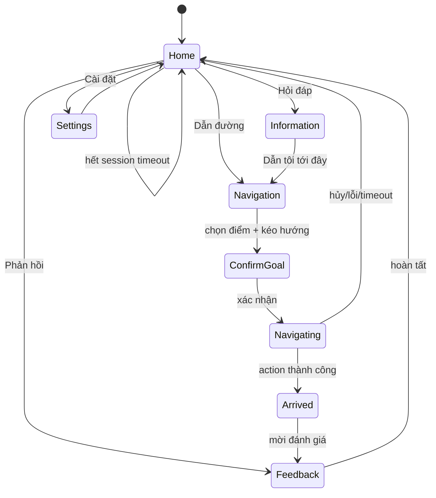
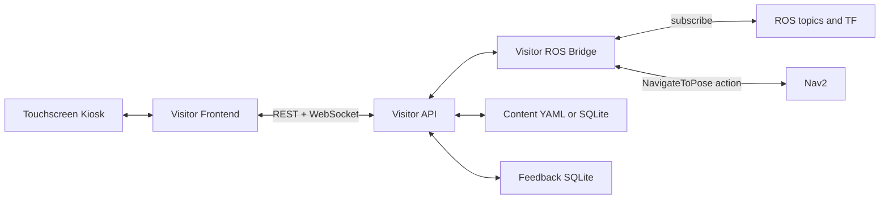
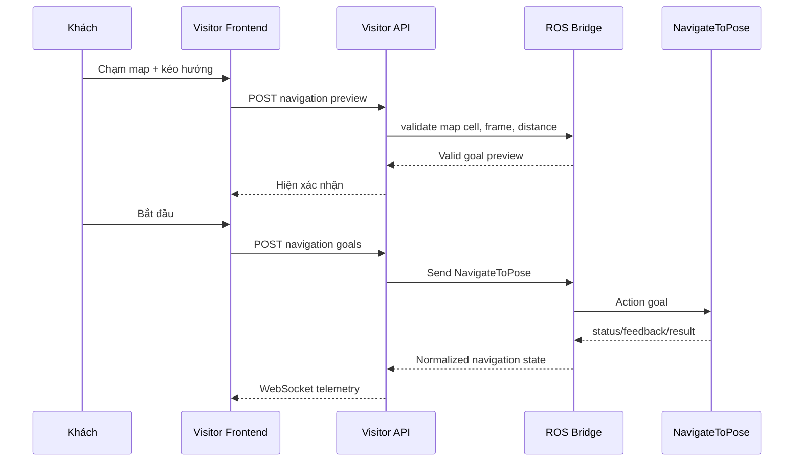

# Visitor UI Architecture

## 1. Vai trò

Visitor UI là màn hình công khai đặt trên robot phục vụ sảnh. Mục tiêu: khách chọn dịch vụ nhanh, không cần biết ROS hoặc Nav2.

Visitor UI không thay thế `robot_ui`:

| Visitor UI | `robot_ui` |
|---|---|
| Khách, sảnh, kiosk, toàn màn hình | Admin/developer dashboard |
| Dẫn đường, hỏi đáp, language, feedback | ROS graph, logs, hardware, diagnostics |
| Ít thông tin, nút lớn | Telemetry chi tiết, thao tác kỹ thuật |
| NavigateToPose qua backend kiểm soát | Read-only hiện tại |

## 2. UX flow



### Home

- Khoảng `70%` diện tích là emotion face.
- Thanh dưới: `Home`, `Dẫn đường`, `Hỏi đáp`, `Cài đặt`, `Phản hồi`.
- Không có map, camera, log, node/topic hoặc metric kỹ thuật.
- Sau `60 s` không tương tác, UI về Home và xóa state phiên khách.

### Dẫn đường

1. Chọn nhanh POI: lễ tân, căn tin, nhà vệ sinh, phòng ban.
2. Hoặc chạm map.
3. Kéo từ điểm chạm để tạo heading arrow.
4. Xác nhận điểm đến/hướng.
5. Backend validate cell map, khoảng cách, timeout, vùng cấm.
6. Robot chạy: map đơn giản, robot marker, goal marker, tiến độ, nút hủy.
7. Đến nơi: emotion `arrived`, mời feedback ngắn.

### Hỏi đáp

- Câu hỏi nhanh: giới thiệu robot, địa điểm, giờ làm việc, cách dùng, sự kiện.
- Text input lớn, virtual keyboard khi cần.
- Bản đầu dùng keyword search trong knowledge base local.
- Câu trả lời có thể có action `Dẫn tôi tới đây` hoặc `Mở bản đồ`.
- Không gửi câu hỏi ra dịch vụ bên ngoài ở bản đầu.

### Cài đặt công khai

- Việt/English.
- Cỡ chữ.
- Tương phản cao.
- Âm lượng TTS khi có voice.
- Giới thiệu robot, quyền riêng tư, hướng dẫn.

Không đưa port, topic, map editor, manual control, PID, LiDAR hay system config vào menu này.

### Feedback

- Rating: `Rất tốt`, `Tốt`, `Bình thường`, `Chưa tốt`.
- Chủ đề: `Dẫn đường`, `Thông tin`, `Giao diện`, `Khác`.
- Text optional, tối đa `500` ký tự.
- Lời cảm ơn, sau đó kết thúc session.

## 3. Emotion face

### Phong cách

- SVG/CSS hoặc Canvas; không cần ảnh raster ở bản đầu.
- Hai mắt tròn/bo góc, đồng tử, lông mày, miệng ngắn.
- Nền sáng; dùng màu primary/teal trong `config/visitor_ui.yaml`.
- Animation chậm, thân thiện; không dùng chuyển động quá nhanh.
- Vùng touch không đặt lên mặt; thao tác nằm dưới/màn hình chức năng.

### State

| State | Khi nào dùng | Biểu cảm/animation |
|---|---|---|
| `idle` | Không tương tác | Blink ngẫu nhiên, breathing scale `1–2%`. |
| `greeting` | Chạm màn hình/wave trigger sau này | Mắt cong nhẹ, cười, glow ngắn. |
| `thinking` | Search, tải map, gửi goal | Đồng tử nhìn lên, ba chấm/pulse. |
| `navigating` | NavigateToPose active | Face thu nhỏ header; map là nội dung chính. |
| `arrived` | Goal thành công | Mắt sáng, cười, “Đã đến nơi”. |
| `warning` | Goal từ chối, obstacle lâu, action failed | Amber, lông mày nghiêng nhẹ; không giận dữ. |
| `offline` | ROS/Nav2 không sẵn sàng | Xám, blink chậm, “Robot đang tạm bận”. |

Emotion không cần camera/YOLO ở bản đầu:

```text
Home idle                  -> idle
Touch / mở session         -> greeting
Search / map loading       -> thinking
NavigateToPose accepted    -> navigating
Action succeeded           -> arrived
Action rejected/failed     -> warning
ROS bridge unavailable     -> offline
```

Sau này `/pose/wave_detected` có thể trigger `greeting`, nhưng kiosk cơ bản không phụ thuộc pipeline GPU này.

## 4. Kiến trúc phần mềm



### Frontend kiosk

- React + TypeScript + Vite tại `src/visitor_ui/frontend/` khi bắt đầu code.
- Full-screen browser/Chromium kiosk mode.
- Local state: language, screen, question, goal preview, session timeout.
- Persistent browser state chỉ gồm accessibility/language; không giữ lịch sử khách.

### Visitor API

- FastAPI process riêng: `visitor_ui_server` khi implementation.
- REST cho content/POI/feedback; WebSocket cho robot state.
- Validation trước mọi navigation command.
- Không import hoặc dùng chung runtime với `robot_ui`.

### Visitor ROS bridge

Node dự kiến: `/visitor_ui_bridge`.

Subscribe tối thiểu:

| ROS source | Mục đích visitor UI |
|---|---|
| `/map` | Render map, chuyển pixel/toạ độ map, validate cell. |
| `/odom` và TF `map -> base_footprint` | Robot marker/vị trí tương đối. |
| `/navigate_to_pose/_action/status` | Trạng thái di chuyển. |
| `/plan` | Route preview nếu Nav2 publish ổn định. |
| `/battery` | Thông báo “Robot cần sạc” khi cần. |

Quyền ROS:

| ROS API | Quyền dùng |
|---|---|
| `/navigate_to_pose` | Gửi goal sau xác nhận + validation. |
| Cancel của goal visitor UI tạo | Hủy chuyến đi từ màn hình khách. |

Cấm ở visitor bridge:

- Không publish `/cmd_vel`.
- Không gọi motor/LiDAR service.
- Không sửa Nav2 parameter, map, TF, hardware config.
- Không expose ROS graph/log/raw camera qua HTTP công khai.

## 5. Nguồn dữ liệu

| Loại | Nguồn đầu tiên | Nguồn lâu dài |
|---|---|---|
| Điểm đến | `config/places.yaml` | SQLite/CMS nội bộ có approval. |
| Hỏi đáp | `config/knowledge_base.vi.yaml` | Knowledge base có version + review. |
| Theme/cài đặt | `config/visitor_ui.yaml` | Admin content tooling, không mở cho khách. |
| Map | `/map` ROS topic | `/map` + backend cache/metadata. |
| Navigation state | Nav2 action, `/odom`, TF | Giữ nguồn ROS. |
| Feedback | SQLite local | Đồng bộ internal DB khi cần. |

Feedback table đề xuất:

```text
feedback(
  id, created_at, language, rating, category,
  comment, active_screen, destination_id,
  navigation_result
)
```

Không lưu tên, số điện thoại, camera frame, raw question history hoặc ROS logs trong feedback storage.

## 6. Luồng dữ liệu điều hướng



Validation trước `NavigateToPose`:

1. ROS/Nav2 active.
2. Goal dùng frame `map`.
3. Cell không occupied/unknown, không sát obstacle.
4. Distance lớn hơn `minimum_goal_distance_m`.
5. Goal nằm trong map boundary hoặc POI được phê duyệt.
6. Không có visitor navigation goal active khác.
7. Có timeout/cancel rõ ràng.

## 7. API nội bộ dự kiến

```text
GET  /api/v1/visitor/state
GET  /api/v1/visitor/map
GET  /api/v1/visitor/places
GET  /api/v1/visitor/questions?query=...
POST /api/v1/visitor/navigation/preview
POST /api/v1/visitor/navigation/goals
POST /api/v1/visitor/navigation/cancel
POST /api/v1/visitor/feedback
WS   /ws/visitor
```

Browser chỉ gọi API này. Không dùng `rosbridge`, raw ROS websocket hoặc direct DDS từ frontend.
